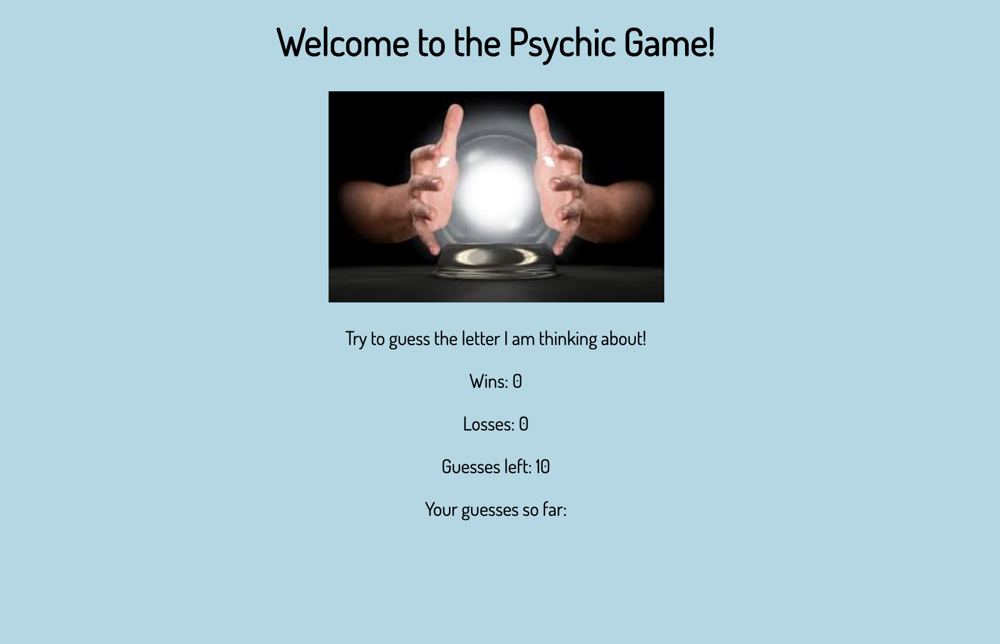

# Psychic-Game

Computer Psychic Game. These apps will run in the browser, and feature dynamically updated HTML and CSS powered by JavaScript code.

1. The app randomly picks a letter, and the user has to guess which letter the app chose. This includes the following text      on the page:

2. Guess what letter I'm thinking of

3. Wins: (# of times the user has guessed the letter correctly)

4. Losses: (# of times the user has failed to guess the letter correctly after exhausting all guesses)

5. Guesses Left: (# of guesses left. This will update)

8. Your Guesses So Far: (the specific letters that the user typed. Display these until the user either wins or loses.)

9. When the player wins, increase the Wins counter and start the game over again (without refreshing the page).

10. When the player loses, increase the Losses counter and restart the game without a page refresh (just like when the user wins).

## Getting Started

1. Download zip file.

2. Open file in IDE of choice to view code. 

3. Open `index.html` in browser to view application. 

## Built With

* [Javascript](https://developer.mozilla.org/en-US/docs/Web/JavaScript) - The programming language used for all logic of the game. 
* [CSS](https://developer.mozilla.org/en-US/docs/Web/css) - used for styling of the application. 
* [Google Fonts](https://fonts.google.com/) - Used to generate font styles. 

## Authors

* **Jonathan Peine** - *Initial work* - [GitHub](https://github.com/johandenver)

## Acknowledgments

* shout out to TA, Instructor and Tutor! 

